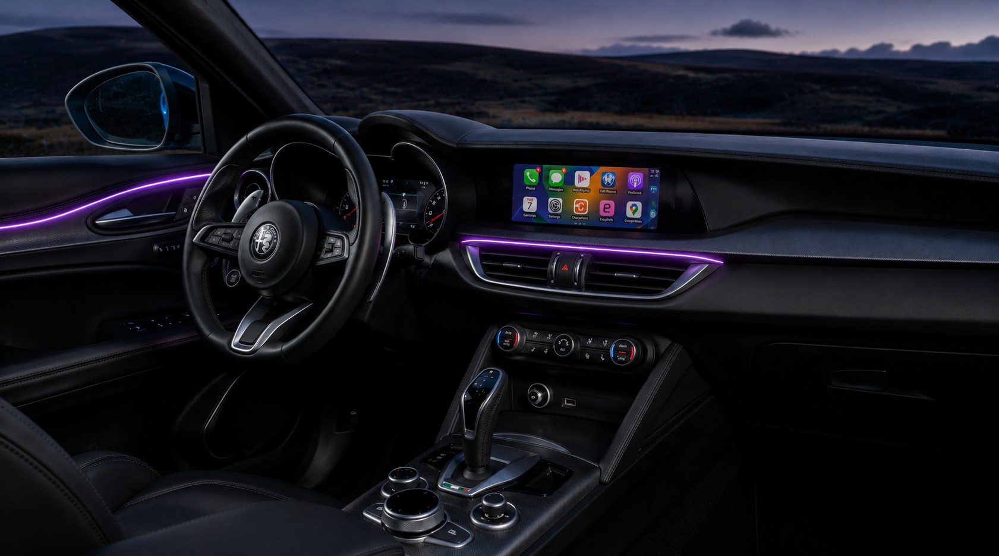
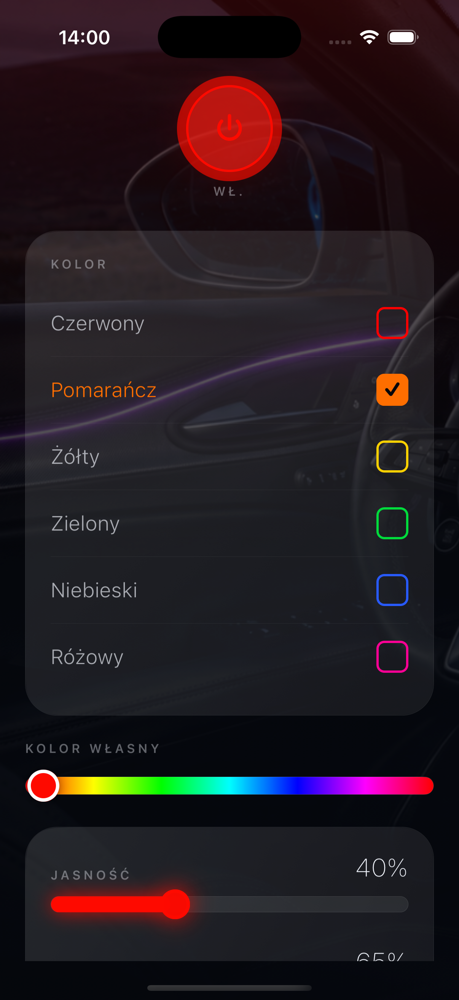
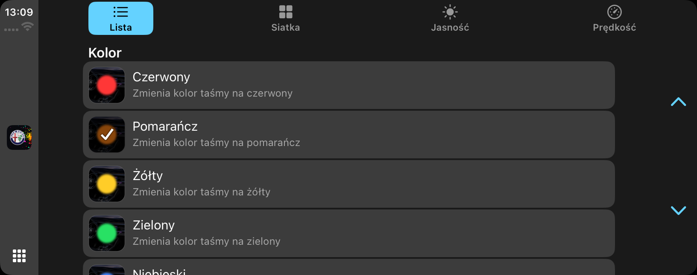
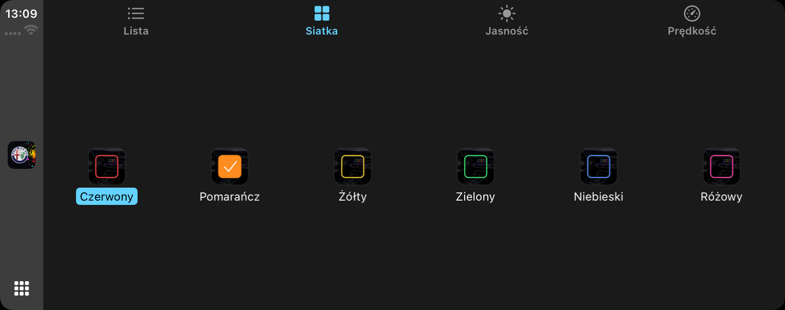
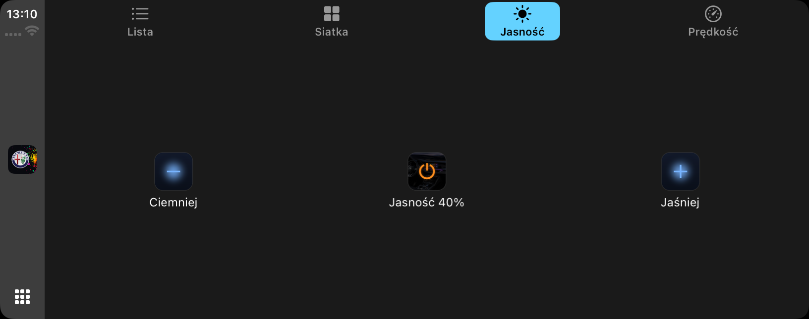
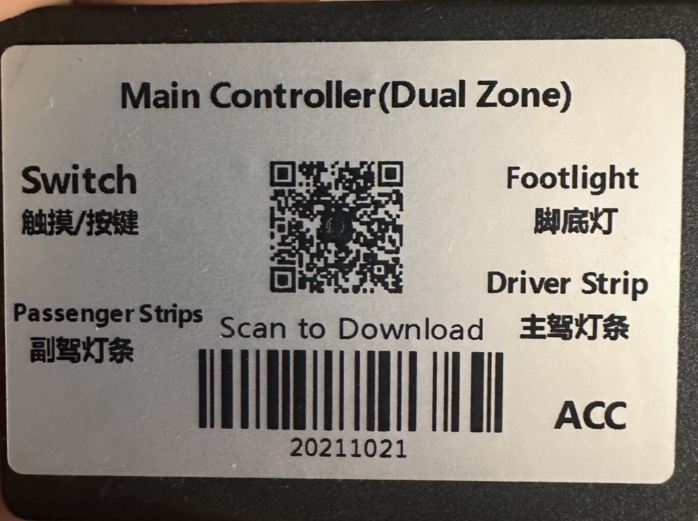

# Alfa Romeo Ambiente Light (CarPlay)

Aplikacja **React Native** sterująca taśmami LED **LEDCAR** w Alfa Romeo przez **Bluetooth LE**, z integracją **Apple CarPlay**. Protokół sterownika odtworzony przez analizę pakietów BLE; własny, lekki interfejs na telefon i ekran auta.



📖 **Artykuł (historia projektu + reverse engineering):** [Jak zbudowałem własne sterowanie oświetleniem ambient w swoim aucie](https://www.linkedin.com/pulse/jak-zbudowałem-własne-sterowanie-oświetleniem-w-swoim-daniel-szantar-b1kwf/)

## Funkcje

### Telefon (iOS)
- Ciemny, „kosmiczny" UI: glow, glassmorphism, zdjęcie wnętrza Alfy w tle
- **BLE**: skan po nazwie `LEDCAR-`, lista wyboru urządzeń, auto-połączenie, zapamiętywanie urządzenia
- **Kolory**: presety (checkboxy) + suwak barw; **jasność** i **prędkość** (suwaki); **power**; tryby **7 kolorów** i **Oddech**
- Kalibracja kolorów pod realny render taśmy; zapis komend bez potwierdzenia
- Persystencja ustawień (MMKV): kolor, jasność, prędkość
- Własna ikona AR + splash

<p align="center">
  
</p>

### CarPlay (entitlement `carplay-driving-task`)
- Zakładki **Lista** / **Siatka** / **Jasność** / **Prędkość**
- **Lista**: kolory z checkboxami (glow) i opisami; tryby z opisem działania
- **Siatka**: duże kafle kolorów z ✓ na wybranym (na szerokim ekranie — jeden rząd)
- **Jasność**: **Ciemniej / Jaśniej** oraz środkowy przycisk power z aktualną wartością (w kolorze wybranego presetu, szary gdy wył.)
- **Prędkość**: **Wolniej / Szybciej** oraz obrotomierz z aktualną wartością
- Komunikat **„Oświetlenie Ambiente niedostępne w trybie świateł dziennych"** (Odśwież / OK) z cyklicznym sprawdzaniem dostępności
- Wspólny stan (store) z aplikacją telefonu; poprawny **zimny start** (odpalenie z ekranu auta pokazuje zawartość bez otwierania apki na telefonie)

| Lista (kolory) | Siatka | Jasność |
|:---:|:---:|:---:|
|  |  |  |

> CarPlay przy `driving-task` korzysta wyłącznie z szablonów (Grid/List/TabBar) — własny, dowolny UI wymaga entitlementu `carplay-maps`/`communication`.

## Sprzęt i protokół

Sterownik **„Main Controller (Dual Zone)"** (klon HM-10, BLE UART). Protokół odtworzono, podsłuchując komunikację oryginalnej aplikacji skanerem pakietów BLE — komendy to stałe 9-bajtowe ramki `7E FF … EF` zapisywane bez potwierdzenia do charakterystyki GATT `FFE1`.

<p align="center">
  
</p>

## Stos
React Native 0.86 (New Architecture) · TypeScript · `react-native-ble-plx` · `react-native-carplay` · Zustand · MMKV · Reanimated · Gesture Handler · SVG

## Uruchomienie (dev)
```sh
npm install            # patche react-native-carplay nakładane automatycznie (patch-package)
cd ios && pod install && cd ..
npm start              # Metro
npm run ios            # telefon/symulator
```
CarPlay na symulatorze: **Simulator → I/O → External Displays → CarPlay**. BLE działa tylko na fizycznym urządzeniu.

## Patche
`patches/react-native-carplay+2.4.1-beta.0.patch` naprawia `resolveAssetSource` (RN 0.86) oraz honorowanie `accessoryImage` w `parseListItems`. Nakładane przez `postinstall: patch-package`.
